# Avaliação — Engenharia de Software
**Sistema Integrado de Gestão de Farmácia — MVP Definido pelo Estudante**

Aluno: Calebe Matheus Moreira Moraes  
RA: 24000974
Data: 26/03/2026  

---

# 1. Definição do MVP
O que está DENTRO do MVP:

-Módulo de PDV Completo: Venda de produtos comuns e consulta de estoque em tempo real para evitar furos no inventário.
-Gestão de Estoque Base: Atualização automática de entradas (compras) e saídas (vendas).
-Cadastro Rápido de Clientes: Identificação básica (CPF/Nome) para permitir o histórico de compras.
-Financeiro Essencial: Lançamento automático de Contas a Receber (para vendas a prazo) e -Contas a Pagar (para compras de fornecedores).
-Segurança (Login): Autenticação básica para separar o que o Atendente faz do que o Gerente faz.

O que está FORA do MVP:

-Módulo de BI e Relatórios Avançados: Gráficos de desempenho e previsões de demanda (isso entra na V2).
-Integração SNGPC: O envio automático de dados de medicamentos controlados para a ANVISA (o sistema valida a receita no balcão, mas a exportação de arquivos fica para depois).
-Transferência entre Unidades: O ajuste de estoque entre filiais será feito manualmente nesta fase inicial.
-Módulo de Fidelidade/Promoções: Regras de pontos ou descontos progressivos complexos.

Por que essas escolhas foram feitas?

-A prioridade foi estancar as perdas financeiras causadas por estoques divergentes e falhas em lançamentos manuais, que são as dores principais citadas pela diretoria.
-Ao focar na trindade Venda-Estoque-Financeiro, garantimos que a operação básica seja confiável. Deixamos a parte de inteligência de dados (Relatórios) e automações regulatórias (SNGPC) para o próximo ciclo, pois elas dependem de uma base de dados já saneada e funcional. 

Exemplo de início:  

Meu MVP cobre o fluxo transacional crítico de vendas (PDV) e a integridade do inventário, garantindo que cada saída de produto no balcão reflita imediatamente no saldo da unidade e gere o registro financeiro correspondente

---

# 2. Regras de Negócio (mínimo: 5)
Liste e descreva **cada RN** de forma clara.

RN01 - Segregação de Funções em Medicamentos Controlados: A dispensação de substâncias constantes nas portarias de controle especial (ex: Portaria 344) exige obrigatoriamente a assinatura digital ou liberação sistêmica do perfil Farmacêutico, impedindo que o Atendente finalize a baixa de forma autônoma.

RN02 - Bloqueio Inventário Negativo: O sistema deve atuar como uma trava lógica, impedindo a conclusão de vendas ou transferências de saída se o saldo em estoque físico da unidade for insuficiente (Estoque disponivel < Quantidade Solicitada).

RN03 - Gatilho Lançamento Financeiro: Toda transação de venda classificada como "Convênio" ou "Crediário Próprio" deve disparar um evento automático de criação de título no módulo de Contas a Receber, vinculando o débito ao CPF/CNPJ do cliente.

RN04 - Conciliação de Entrada de Mercadorias: O incremento patrimonial no estoque de uma unidade só é efetivado após o "Check-in" da Nota Fiscal de compra, garantindo que o valor de custo e a quantidade física coincidam com o pedido de compra original.

RN05 - Política Ponto de Pedido (Ressuprimento): O sistema deve monitorar o giro de estoque e disparar alertas críticos de ruptura sempre que o saldo atingir o Estoque Mínimo definido pelo Gerente para aquele SKU (Stock Keeping Unit).

---

# 3. Requisitos Funcionais (mínimo: 8)

Lista de requisitos funcionais do MVP:

RF01 — Catálogo Centralizado de Produtos:
O sistema deve manter um repositório único de produtos, com atributos de NCM, fabricante, unidade de medida e código EAN-13, para garantir a padronização entre todas as filiais.
RF02 — Sincronização de Inventário Multiloja:
Permitir que uma unidade consulte, em tempo real, a disponibilidade de um item em outras farmácias da rede, para facilitar transferências entre lojas.
RF03 — Módulo de Quick-Check-in de Clientes:
Interface simplificada para captura de dados básicos de clientes (CPF, Nome, Telefone), durante o fluxo de PDV (Ponto de Venda), para fins de fidelização.
RF04 — Emissão de Documentos Fiscais e Comprovantes:
Geração automática de cupons de venda e extratos de conferência de itens, com detalhamento de impostos e descontos aplicados.
RF05 — Automação de Contas a Pagar:
Registro automático de obrigações financeiras, a partir do faturamento de pedidos de compra junto aos fornecedores cadastrados.
RF06 — Rastreabilidade de Lotes e Validade:
O sistema deve permitir o registro do lote e data de validade no momento da entrada, bloqueando a venda de itens vencidos.
RF07 — Dashboard de Indicadores Gerenciais (BI):
Disponibilizar visões consolidadas de vendas (Curva ABC de produtos), ticket médio por unidade e inadimplência de convênios.
RF08 — Gestão de Devoluções e Perdas:
Funcionalidade para estorno de vendas ou baixa por avaria/vencimento, com justificativa obrigatória para auditoria.

---

# 🛡 4. Requisitos Não Funcionais (mínimo: 4)
RNF01 — Catálogo Centralizado de Produtos:
O sistema deve manter um repositório único de produtos, com atributos de NCM, fabricante, unidade de medida e código EAN-13, garantindo a padronização entre todas as filiais.
RNF02 — Sincronização de Inventário Multiloja:
O sistema deve permitir que uma unidade consulte, em tempo real, a disponibilidade de um item em outras farmácias da rede, facilitando transferências entre lojas.
RNF03 — Módulo de Quick-Check-in de Clientes:
O sistema deve oferecer uma interface simplificada para captura de dados básicos de clientes (CPF, nome, telefone) durante o fluxo de PDV (Ponto de Venda), garantindo agilidade no atendimento.
RNF04 — Emissão de Documentos Fiscais e Comprovantes:
O sistema deve gerar automaticamente cupons de venda e extratos de conferência de itens, com detalhamento de impostos e descontos aplicados.
RNF05 — Automação de Contas a Pagar:
O sistema deve registrar automaticamente obrigações financeiras a partir do faturamento de pedidos de compra junto aos fornecedores cadastrados.
RNF06 — Rastreabilidade de Lotes e Validade:
O sistema deve permitir o registro de lote e data de validade no momento da entrada, garantindo o bloqueio da venda de itens vencidos.
RNF07 — Dashboard de Indicadores Gerenciais (BI):
O sistema deve disponibilizar visões consolidadas de vendas, como curva ABC de produtos, ticket médio por unidade e inadimplência de convênios.
RNF08 — Gestão de Devoluções e Perdas:
O sistema deve permitir o estorno de vendas ou baixa por avaria/vencimento, exigindo justificativa obrigatória para fins de auditoria.

---

# 5. Casos de Uso (mínimo: 10)
### Inserir **diagrama de casos de uso geral**, demonstrando claramente:
UC01 — Realizar Venda (Processo Principal)

Ator: Atendente.
Descrição: Registra a saída de produtos e processa o pagamento.
Relacionamento: UC02 (Consultar Estoque).

UC02 — Consultar Disponibilidade de Estoque (Validação)

Ator: Atendente / Gerente.
Descrição: Verifica, em tempo real, se o SKU possui saldo positivo na unidade ou na rede.

UC03 — Validar Receita Médica (Controle Sanitário)

Ator: Farmacêutico.
Descrição: Verifica a autenticidade e retém os dados da receita para medicamentos controlados.
Relacionamento: UC01 (ativado apenas para itens de classe "Controlado").

UC04 — Registrar Cliente (CRM/Fidelização)

Ator: Atendente.
Descrição: Cadastro rápido de dados (CPF/Nome) para histórico de compras.
Relacionamento: UC01 (ativado se o cliente não possuir registro prévio).

UC05 — Processar Venda a Prazo (Módulo Convênio)

Ator: Atendente.
Descrição: Valida o limite de crédito e registra o título no financeiro.
Relacionamento: UC01 (ativado se a forma de pagamento for "Convênio" ou "A Prazo").

UC06 — Gerenciar Entrada de Mercadorias (Compras)

Ator: Gerente.
Descrição: Lançamento de NF-e de fornecedores para atualização de inventário.
Relacionamento: UC07 (Lançar Contas a Pagar).

UC07 — Lançar Contas a Pagar (Integração Financeira)

Ator: Financeiro / Gerente.
Descrição: Instancia uma obrigação financeira baseada na compra realizada.

UC08 — Controlar Contas a Receber (Conciliação)

Ator: Financeiro.
Descrição: Monitora vencimentos e status de pagamentos de clientes e convênios.

UC09 — Emitir Relatórios Estratégicos (BI/Auditoria)

Ator: Administrador / Gerente.
Descrição: Consolida dados de vendas, perdas e giro de estoque para tomada de decisão.
Relacionamento: UC10 (Autenticar Usuário).

UC10 — Autenticar Usuário (Segurança/RBAC)

Ator: Todos.
Descrição: Valida as credenciais e define o nível de acesso (Role-Based Access Control) do usuário na sessão ativa.

Relacionamentos Entre Casos de Uso:
Includes:
UC01 → UC02 (Venda exige estoque).
UC06 → UC07 (Compra exige lançamento financeiro).
UC09 → UC10 (Relatórios exigem autenticação).
Extends:
UC01 ← UC03 (Apenas para medicamentos controlados).
UC01 ← UC04 (Apenas para clientes novos).
UC01 ← UC05 (Apenas para pagamentos faturados/prazo).

---

# 6. Documentação dos Casos de Uso
Para **cada caso de uso**, utilize o template abaixo:
---

UC01 — Realizar Venda

Ator(es): Atendente.
Descrição: Processo de registrar itens e receber o pagamento do cliente.

Pré-condições: Caixa aberto e usuário logado.
Pós-condições: Venda registrada e estoque atualizado.

Fluxo Principal
Atendente inicia a venda e bipa os produtos.
Sistema executa a consulta de estoque (Include UC02).
Atendente seleciona a forma de pagamento.
Sistema finaliza a transação e imprime o comprovante.
Fluxos Alternativos / Exceções
FA01 — Medicamento Controlado: O sistema exige a validação do farmacêutico (Extend UC03).
FA02 — Cliente Novo: O atendente realiza o cadastro rápido (Extend UC04).
Relacionamentos
Include: UC02 (Consultar Estoque).
Extend: UC03 (Validar Receita), UC04 (Registrar Cliente), UC05 (Venda a Prazo).

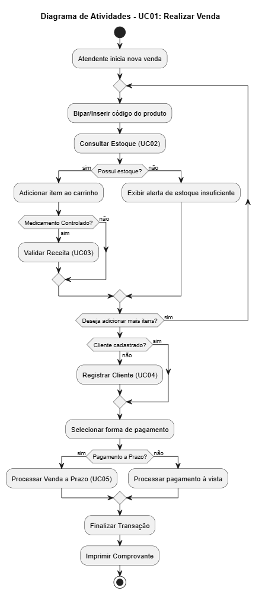

UC02 — Consultar Disponibilidade de Estoque

Ator(es): Atendente / Gerente.
Descrição: Verificação automática da quantidade de produtos.

Pré-condições: Produto identificado por código ou nome.
Pós-condições: Quantidade disponível exibida na tela.

Fluxo Principal
Usuário solicita a busca do item.
Sistema consulta o banco de dados da unidade.
Sistema exibe o saldo em estoque.
Sistema reserva a quantidade para a venda em curso.
Fluxos Alternativos / Exceções
FA01 — Sem estoque local: Sistema sugere consulta em outras unidades da rede.

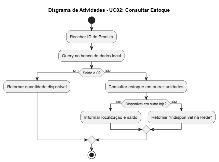

UC03 — Validar Receita Médica

Ator(es): Farmacêutico.
Descrição: Conferência técnica de receitas para remédios controlados.

Pré-condições: Item controlado detectado no carrinho.
Pós-condições: Venda autorizada no sistema.

Fluxo Principal
Farmacêutico analisa a receita física.
Farmacêutico insere os dados do médico e paciente no sistema.
Sistema valida as informações.
Sistema libera a trava do item na venda.
Fluxos Alternativos / Exceções
FA01 — Receita Inválida: Farmacêutico recusa a venda e o item é removido do carrinho.

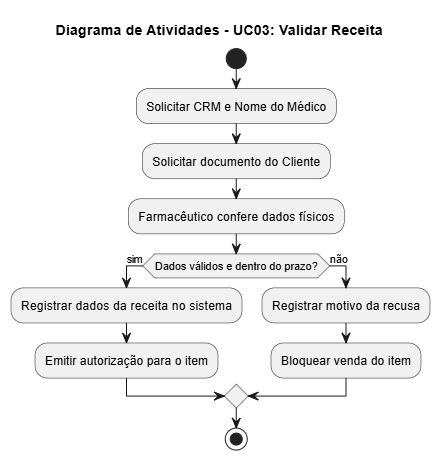

UC04 — Registrar Cliente

Ator(es): Atendente.
Descrição: Cadastro de novos clientes para histórico ou descontos.

Pré-condições: Cliente não localizado pelo CPF.
Pós-condições: Cliente cadastrado e vinculado à venda.

Fluxo Principal
Atendente solicita Nome e CPF.
Atendente preenche os dados no sistema.
Sistema salva o novo registro.
Venda prossegue com o cliente identificado.

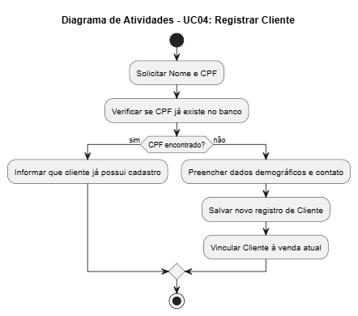

UC05 — Processar Venda a Prazo

Ator(es): Atendente.
Descrição: Venda via convênio ou crediário para pagamento futuro.

Pré-condições: Cliente identificado e com crédito disponível.
Pós-condições: Conta a receber gerada automaticamente.

Fluxo Principal
Atendente seleciona "Venda a Prazo".
Sistema verifica o limite de crédito do cliente.
Cliente assina o comprovante (físico ou digital).
Sistema registra o débito no financeiro.

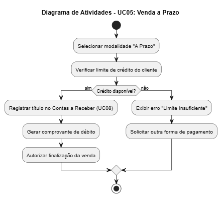

UC06 — Gerenciar Entrada de Mercadorias

Ator(es): Gerente.
Descrição: Entrada de produtos comprados de fornecedores.

Pré-condições: NF-e disponível para lançamento.
Pós-condições: Estoque atualizado e conta a pagar gerada.

Fluxo Principal
Gerente inicia o recebimento da nota.
Gerente confere os produtos físicos com a nota.
Sistema atualiza as quantidades no estoque.
Sistema gera o lançamento financeiro (Include UC07).
Relacionamentos
Include: UC07 (Lançar Contas a Pagar).

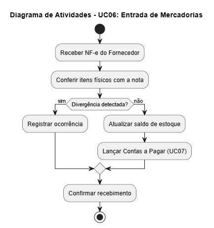

UC07 — Lançar Contas a Pagar

Ator(es): Financeiro / Gerente.
Descrição: Registro de dívidas da farmácia (fornecedores, luz, etc).

Pré-condições: Documento de cobrança identificado.
Pós-condições: Conta agendada no calendário financeiro.

Fluxo Principal
Usuário insere valor, vencimento e fornecedor.
Sistema classifica a despesa.
Sistema salva o lançamento como "Aberto".

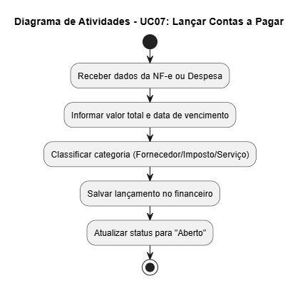

UC08 — Controlar Contas a Receber

Ator(es): Financeiro.
Descrição: Gestão de pagamentos que a farmácia deve receber.

Pré-condições: Vendas a prazo realizadas anteriormente.
Pós-condições: Baixa no título financeiro.

Fluxo Principal
Financeiro consulta títulos vencendo no dia.
Financeiro identifica o pagamento do cliente/convênio.
Financeiro registra a baixa (recebimento).
Sistema atualiza o status para "Recebido".

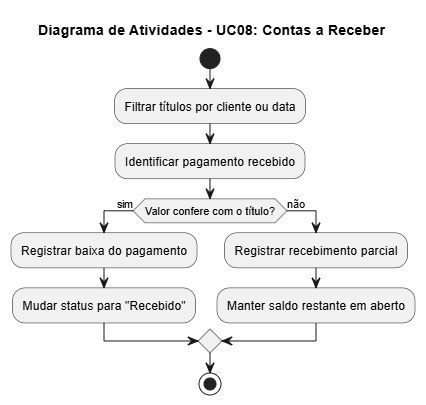

UC09 — Emitir Relatórios Estratégicos

Ator(es): Administrador / Gerente.
Descrição: Geração de dados para tomada de decisão.

Pré-condições: Autenticação de nível gerencial realizada (Include UC10).
Pós-condições: Relatório gerado em tela.

Fluxo Principal
Usuário escolhe o tipo de relatório (Ex: Mais Vendidos).
Usuário define o período de data.
Sistema processa os dados de vendas e estoque.
Relatório é exibido para análise.
Relacionamentos
Include: UC10 (Autenticar Usuário).

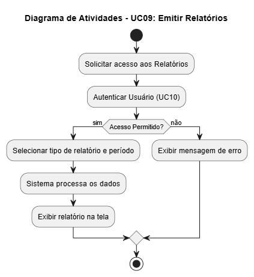

UC10 — Autenticar Usuário

Ator(es): Todos.
Descrição: Controle de login e permissões.

Pré-condições: Usuário possuir cadastro ativo.
Pós-condições: Acesso liberado às telas do sistema.

Fluxo Principal
Usuário insere Login e Senha.
Sistema valida as credenciais.
Sistema identifica o cargo (Atendente, Gerente, etc).
Sistema carrega o menu conforme as permissões.

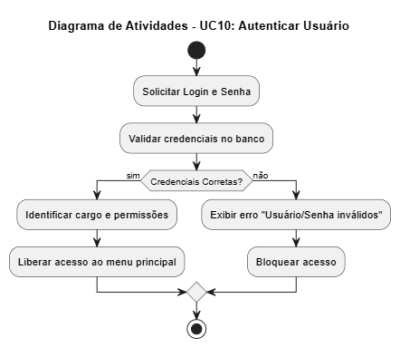

---

- Diagrama Geral:

  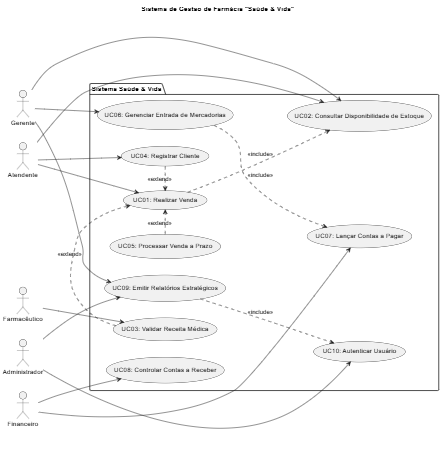
  
---

